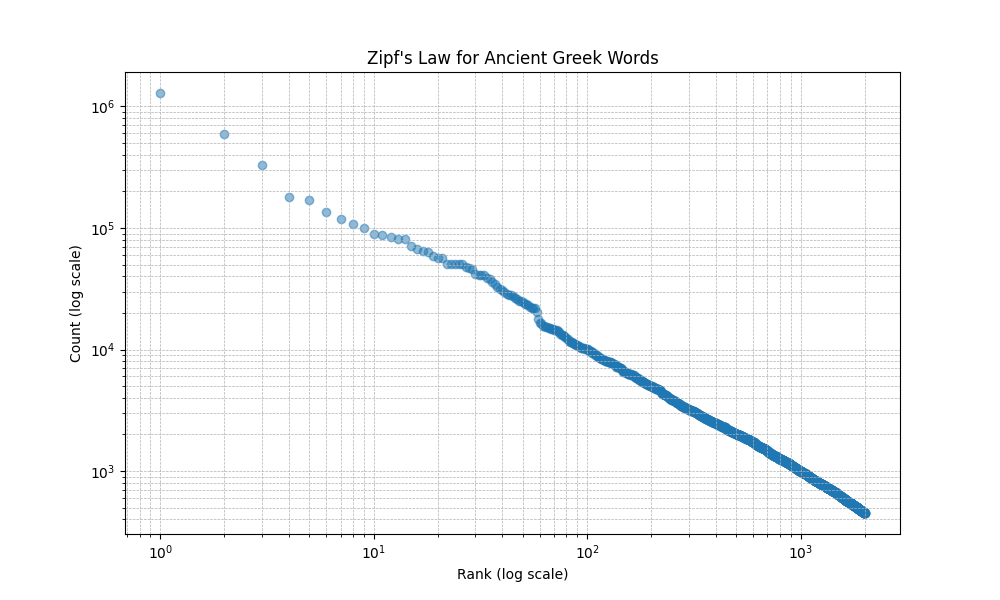

# Statistical Ancient Greek Language Analysis

### The goal of the project was to analyse a sample Ancient Greek language words corpus.

The corpus consists of texts from different areas, such as:
* The Bible: New Testament and Septuagint (Old Testament Greek translation)
* Greek philosophy (e.g. Aristotle)
* Greek poetry (e.g. Homer)
* historians work (e.g. Flavius)
* Greek tragedies (e.g. Sophocles)
* etc.

## Actions performed:
1. Downloaded the corpus
    * from the [source](https://figshare.com/articles/dataset/The_Diorisis_Ancient_Greek_Corpus/6187256?file=11296247).
    * [information](https://www.turing.ac.uk/news/publications/diorisis-ancient-greek-corpus) about the corpus and the authors
    * [more](https://brill.com/view/journals/rdj/3/1/article-p55_55.xml?ebody=full%20html-copy1#d58954549e659) about it.
2. Parsed the XML files using zipfile and xml.etree Python modules to get info about occurences and neighbourhood of the words.
2. Sorted it by their count.
3. Counted the total number of words which is **10_052_828**.
4. Created a list of them with their rank and Zipf's law product:
[Zipf's law](https://en.wikipedia.org/wiki/Zipf%27s_law).
5. Zipf's Law for Ancient Greek words presented as a log-log graph:
    * 
    * which is not bad when compared to a wikipedia example:
    
    (link: [https://en.wikipedia.org/wiki/Zipf%27s_law#/media/File:Zipf-engl-0_English_-_Culpeper_herbal_and_War_of_the_Worlds.svg](https://en.wikipedia.org/wiki/Zipf%27s_law#/media/File:Zipf-engl-0_English_-_Culpeper_herbal_and_War_of_the_Worlds.svg))
6. Created a graph of top 2000 words using networkx Python module to draw (if needed) a circular illegible graph presenting connections between words in 'neighbouring' in the corpus.
7. Retrieved number of connections for each word in the graph and sorted them by the number order.
8. Listed top 50 nouns by words connections and listed them with their English definitions downloaded from Wiktionary API (using Ancient Greek indices).
9. Compared them with the [Swadesh list](https://en.wikipedia.org/wiki/Swadesh_list).
    * [a file with the original Swadesh list from wikipedia](./swadesh_list_50_wikipedia.txt)
        * sample words by random:
            I,
            you,
            we,
            this,
            that,
            who,
            what,
            not,
            all,
            many,
            one,
            two,
            [...],
            man,
            person,
            fish,
            bird,
            [...],
            flesh,
            blood,
            bone,
            grease,
            egg,
            [...],
            ear,
            eye,
            nose,
            mouth,
            tooth...
    * [a file with our 'Swadesh list' from the corpus](./our_swadesh_list.txt)
        * sample words by random:
            word,
            man,
            divine,
            human being,
            master,
            beginning,
            earth,
            beautiful,
            day,
            time,
            father,
            son,
            [...],
            work,
            war,
            deed,
            [...],
            sea,
            place,
            part,
            district,
            a ship,
            goodness,
            measue,
            [...],
            river,
            charge,
            [...],
            beauty,
            dwelling place,
            aim,
            mother,
            a temple,
            means of knowing,
            a wall,
            citizen,
            a fire.
    
    As it appears, our corpus - although enormous (**over 10 million of words in total** - about 180 MB of data) - have more abstract words in its Swadesh list than the original Swadesh list. This can mean that the corpus is not easily understandable for an average speaker who knows only the language's core words.

## Output (containing top 50 ranked words with their Zipf's product, top 200 words by a number of connections in the neighbouring words graph and the list of top 50 nouns with their meanings (mentioned just above in the 10th point)):
[Output of the program](./word_ranking.txt)

## Project structure
```
PROJECT STRUCTURE
├── Diorisis.zip        -> dataset in a form of a ZIP file
├── main.py             -> research logic
├── output_old.txt      -> sample output from an old program version
├── README.md           -> this README
├── requirements.txt    -> modules required
└── word_ranking.txt    -> current output for a brief visualisation
```

## Usage
[file with requirements](./requirements.txt)
1. **Clone the repository:**
    ```bash
    git clone https://github.com/jakseluz/statistical_ancient_greek_language_analysis.git
    cd statistical_ancient_greek_language_analysis/
    ```
2. **Create a Python environment**
    ```bash
    python -m venv ./.venv
    ```
3. **Activate it**
    ```bash
    source ./.venv/bin/activate
    ```
4. **Install dependencies**
    ```bash
    pip install -r ./requirements.txt
    ```
5. **Run the program**
    ```bash
    python main.py
    ```